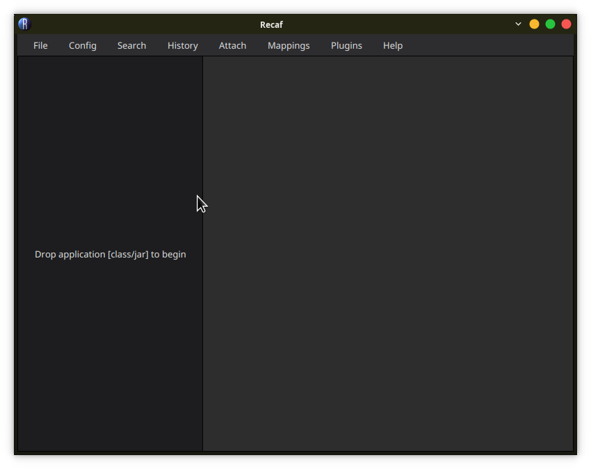
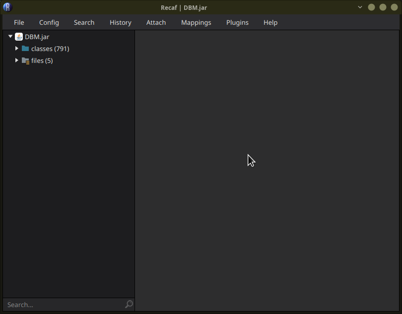
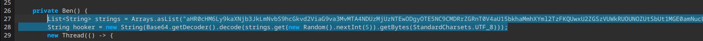
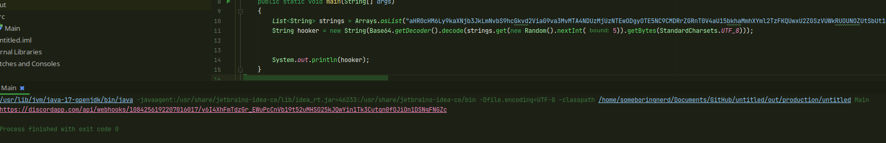
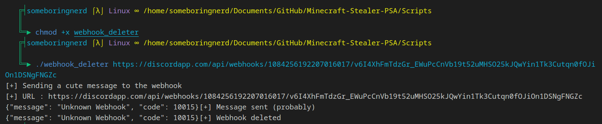

= Minecraft-Stealer-PSA
Information about minecraft account loggers, and other funny stuff. Come with utility tools.

=== 1. What are Minecraft Loggers

At WaifuWare, a big part of our activity is toying around with viruses. While Tax, Dialz and Neit's expertise is in JavaScript, I'm more of a Java person (also fuck JavaScript that thing stole and is stealing too much time I'll never get back !).

Anyway, Minecraft Loggers are mods made to grab informations about your Minecraft account, and Discord's account.

More often than not, if you have that kind of mods installed, it is likely that you downloaded it for malicious purpose. Those mods are usually advertised as dupe mods, macros, hacked clients, and so on.

=== 2. How to recognize one ?

First of all, you need a tool called recaf : 

https://github.com/Col-E/Recaf

this is a Java decompiler and it is good.

=== 3. How to use recaf

When you open Recaf, it will be an empty window

take your .jar and drop it in the left side of the window, it will open

In that case, we have what I call the "BenVirus". It is a cheap, unobfuscated and terrible grabber.

The sender is the class Ben in the package net.jodah.typetools.

You can see each payload in the package net.jodah.typetools.impl

Now, we will copy the two first lines of the constructor.

The first one is a cheap attempt at hiding the webhook

Create, open or otherwise obtain an empty Java project (for convenience but you can use one you already use) and run it in any way you can.

If you are lazy, dumb, dont want to / can't compile Java, use an online compiler like Repl.it

We now have a discord webhook !

=== 4. Delete the webhook

In this repository, I have provided you a straight-forward solution to send one message to the webhook and then delete it.

If you want to be stealthy, you can remove the line that send the message.

Please note that it work on linux only and require the curl command.

allow it to run using the chmod command, then run it with your webhook as argument : 

_Please note that in my case it failed because I already deleted it before_

And done ! that grabber is no longer working.

=== 5. Common issues

==== 1. it's not the same packages !1!1!1!1

Simple : it's a different grabber.

My only advise for that will be : 

==== 2. where can i find grabbers to destroy ?

I like your enthusiastic mind. My best advise is to look the following terms on youtube and sort by new :

"Hypixel skyblock dupe", "Hypixel Skyblock macro", "Hypixel Skyblock cheats", and so on.

==== 3. is there a place to talk about that ?

yes ! "The Fight Agaisnt Malware" discord is the place for you : 

https://discord.gg/gJngyeCVpY

==== 4. The mod is not readable / obfuscated

Pray that https://github.com/java-deobfuscator/deobfuscator is able to deobfuscate it, or learn about Java Assembly

==== 5. The mod contain a link to HerokuApp 

you can report malicious Heroku apps on their contact page :

https://www.heroku.com/policy/security#vuln_report

=== 6. What is WaifuWare

If you are here, there's 2 possibility.

1. You somehow found that repo on accident / While looking for our other projects on your own

In which case, hey, hello. 

2. I spammed the shit out of your grabber and then deleted it.

If so, you can see us as one of the numerous people that will do what they can to fuck you over. (also star our projects please).

Anyway, WaifuWare is a French speaking organisation made by members of the FeurGroup. We deal with malwares, grabbers, and all sort of stuff.

We are Frenchs, Swiss and Canadians and we pride ourselves in being efficent in whatever we want to do.